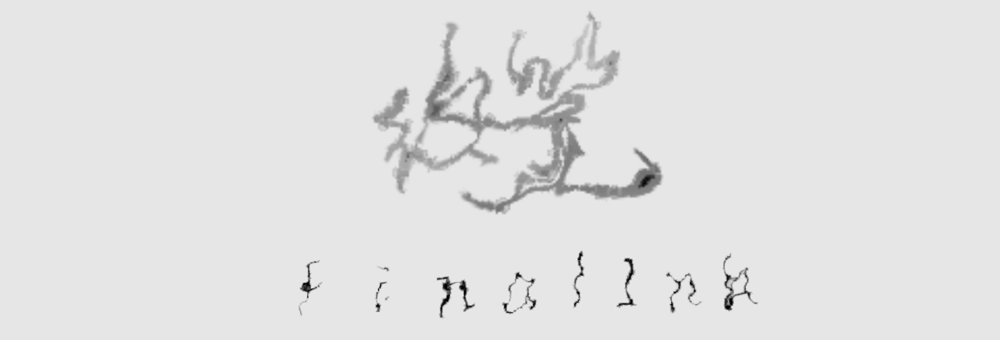

# FinalInk-Generator



**FinalInk-Generator** is an assistive algorithm that simulates fragile, trembling, and fading handwriting — the kind of “final strokes” produced when a person near the end of life loses the ability to speak and can only communicate through handwriting.
This project generates synthetic handwriting images useful for research in OCR robustness, assistive communication, and human-centered design for palliative care.

---

## Table of Contents

* [Key Ideas](#key-ideas)
* [Features](#features)
* [Installation](#installation)
* [Quick Start](#quick-start)
* [Arguments / CLI Options](#arguments--cli-options)
* [Examples](#examples)
* [Advanced Usage & Development](#advanced-usage--development)
* [To Do](#to-do)
* [License & Reference](#license--reference)

---

## Key Ideas

* Simulate **end-of-life handwriting**: trembling, broken strokes, fading ink.
* Produce **paired text ↔ image** datasets for OCR training and evaluation.
* Provide configurable controls for tremor, fading, spacing, and other distortions to study algorithmic behavior on weak/irregular handwriting.

---

## Features

* **End-of-life handwriting simulation**: fragile and irregular stroke modeling.
* **Configurable distortions**: tremor intensity, stroke weakness, spacing irregularity, fading.
* **Batch dataset generation**: generate many synthetic samples per text for research and training.
* **Extensible core operators**: modify algorithms in `ops.py` to add new distortions or behaviors.

---

## Installation

```bash
git clone https://github.com/xzx0554/FinalInk-Generator.git
cd FinalInk-Generator

# Recommended: create a virtual environment
python -m venv venv
source venv/bin/activate   # macOS / Linux
venv\Scripts\activate      # Windows

pip install -r requirements.txt
```

> Python 3.8+ is recommended.

---

## Quick Start

Example command (single font):

```bash
python main.py \
  --texts "FinalInk" \
  --fonts "./fonts/YourFont.ttf" \
  --out ./out_finalink \
  --n_per_text 50
```

Example command (multiple fonts):

```bash
python main.py \
  --texts "I still have things to say" "Time is short" \
  --fonts "./fonts/FontA.ttf" "./fonts/FontB.ttf" \
  --out ./out_finalink \
  --n_per_text 50 \
  --no_overstrike \
  --no_drag
```

**Notes**

* Fonts must be provided by the user (TTF supported). Fonts are **not** included in the repository due to copyright.
* The CLI accepts multiple texts and multiple font files.


---

## Arguments / CLI Options

> The table lists commonly used options. For the authoritative and full list, read the `args` and `configs` section in `tools/generator/cli.py` and `core.py`.

| Option            |        Type |      Default | Description                                           |
| ----------------- | ----------: | -----------: | ----------------------------------------------------- |
| `--texts`         | `list[str]` |         `[]` | One or more texts to render.                          |
| `--text_file`     |       `str` |       `None` | Path to a file containing input lines (one per line). |
| `--fonts`         | `list[str]` | **Required** | Path(s) to `.ttf` font file(s). Multiple accepted.    |
| `--out`           |       `str` | **Required** | Output directory for generated images and metadata.   |
| `--n_per_text`    |       `int` |         `50` | Number of images to generate per text input.          |
| `--bucket`        |       `str` |    `"heavy"` | Distortion preset (`"light"`, `"medium"`, `"heavy"`). |
| `--canvas_w`      |       `int` |       `1024` | Canvas width in pixels.                               |
| `--canvas_h`      |       `int` |        `512` | Canvas height in pixels.                              |
| `--margin`        |       `int` |         `32` | Canvas margin in pixels.                              |
| `--readability`   |     `float` |       `0.35` | Readability factor (0.0–1.0).                         |
| `--illegibility`  |     `float` |        `0.8` | Degree of illegibility (0.0–1.0).                     |
| `--no_overstrike` |        flag |      `False` | Disable 
---

## To Do

* [ ] Support single-line font Bézier curve simulation for more natural stroke deformation.
---


